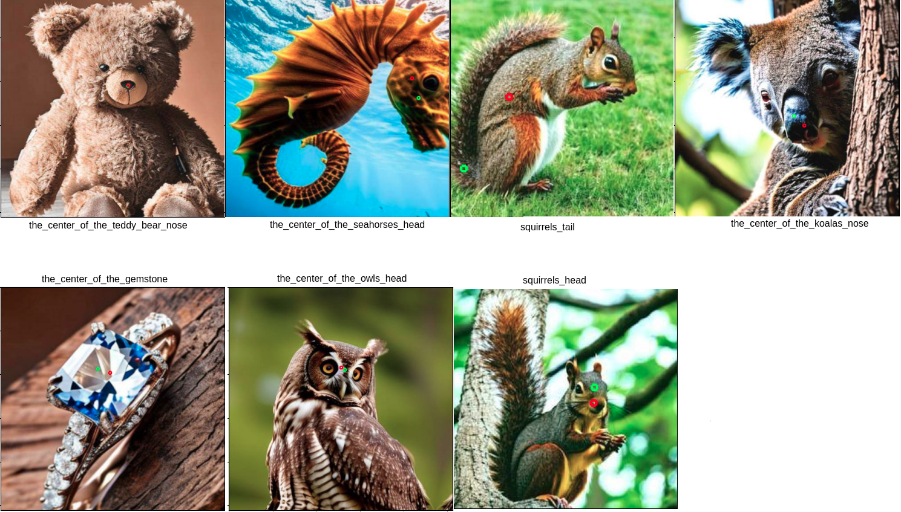
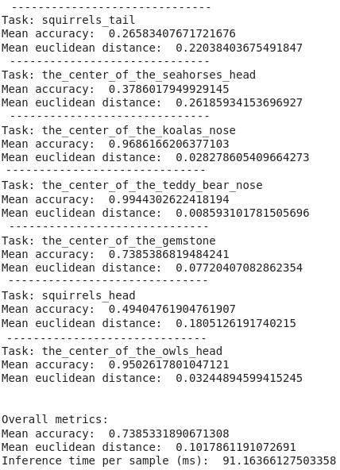

# Zennolab test task

# Install
To use solution on your local computer, run: 
1. Create and activate environment with python 3.7, for example conda: `conda create --name task python=3.7`;
2. Install pytorch, `pip install torch==1.10.1 torchvision==0.11.2 torchaudio==0.10.1`;
3. Install dependencies, `pip install -r requirements.txt`.

Also, you can use solution in google colab, see point __metrics__.

# Results visualization
Green dot is truth coordinate of center, red dot is predicted coordinate of center.

# Metrics
The metrics were obtained in Google Colab notebook, which is available at the [link](https://drive.google.com/file/d/1mpxmdVFO7x3r6Vx4uGgAeZsxSijorbGS/view?usp=sharing).

# How we can improve metrics?
1. Try another model, for example, owlvit base patch 32, owlvit base patch 16, and [another](https://huggingface.co/models?other=zero-shot-object-detection) 
2. Remap text requests, for example instead text request "squirrels_tail" write "the tail of squirrel" or change "the_center_of_the_seahorses_head" to "seahorse head" (experiments have shown that this improves metrics)
3. Get median coordinate of center of several bboxes with low confidence score.